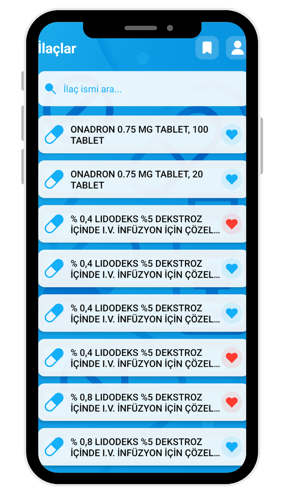
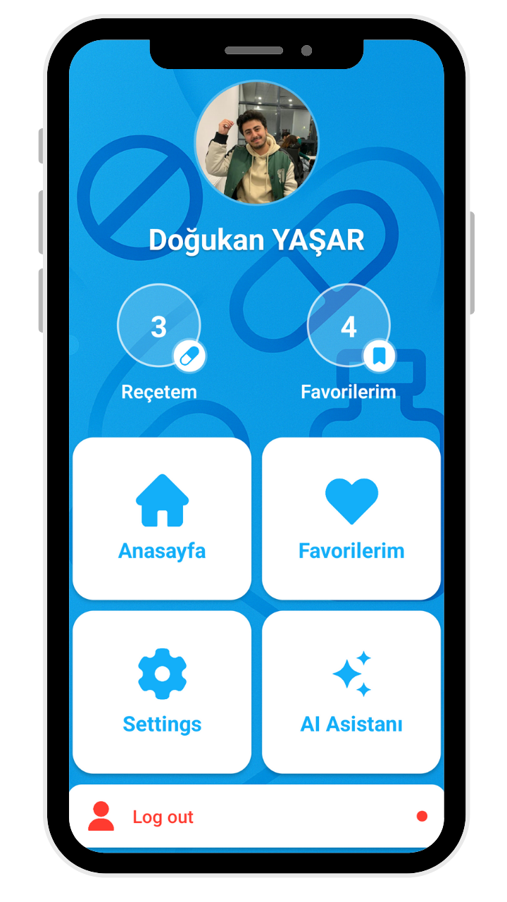
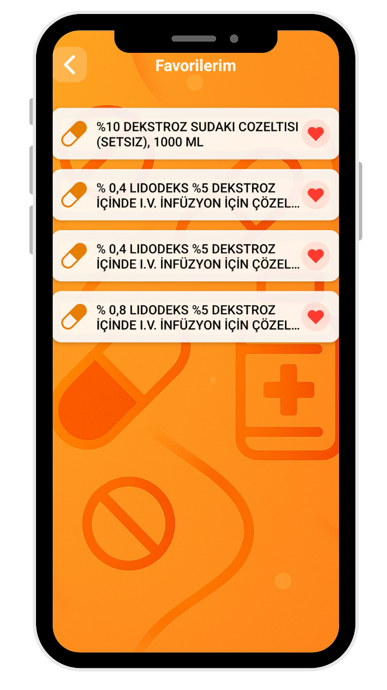

# My React Native Project

This is a sample project showcasing UI designs for a React Native app. Below are the various screens and images used in the application.

## Screens

### Welcome Screen

The welcome screen is the first screen users see when they open the app.

### Login Screen

The login screen allows users to authenticate using their credentials.

### Sign Up Screen

The sign-up screen enables new users to create an account.

---

### Home Screen

This is the home screen of the app where users can navigate to different sections like profile, favorite, and more.

### Profile Screen

The profile screen allows users to view and edit their personal details.

### Favorite Screen

This screen shows the user's favorite items or content within the app.

### Detail Screen

The detail screen provides more information about a specific item, whether it’s a product, service, or feature.

### Medication Screen

The medication screen helps users track their prescriptions and doses.

## Description
Each of these images represents key UI components within the app. They provide the user with a seamless, intuitive interface to navigate through various functionalities such as logging in, viewing personal profiles, and tracking medications.

---

## Contributing
Feel free to contribute by submitting issues, pull requests, or suggestions for improving the app's UI/UX.
