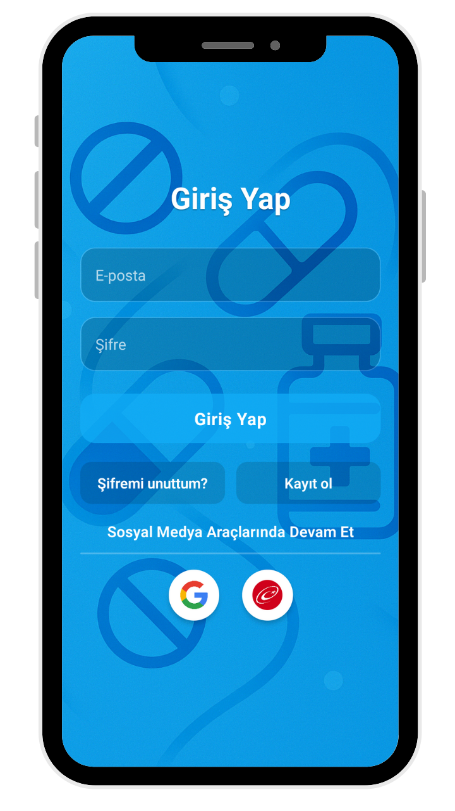

# My React Native Project

This is a sample project showcasing UI designs for a React Native app. Below are the various screens and images used in the application.

## Screens

### Welcome Screen, Login Screen & Sign Up Screen

    
    
    

---

### Home Screen, Profile Screen & Favorite Screen

    
    
    

---

### Detail Screen & Medication Screen

    
    

---

## Description
Each of these images represents key UI components within the app. They provide the user with a seamless, intuitive interface to navigate through various functionalities such as logging in, viewing personal profiles, and tracking medications.

---

## Contributing
Feel free to contribute by submitting issues, pull requests, or suggestions for improving the app's UI/UX.
